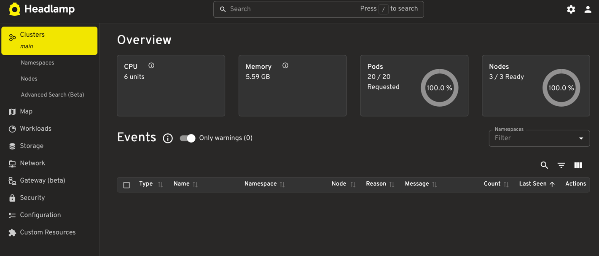

# EKS Dashboard Setup (Headlamp)

This document covers deploying a web-based Kubernetes dashboard on our EKS cluster using [Headlamp](https://headlamp.dev/), the actively maintained successor to the now-archived Kubernetes Dashboard project.

> **Why Headlamp and not `kubernetes-dashboard`?**
> The original Kubernetes Dashboard project was archived on Jan 21, 2026, and its Helm chart repository (`kubernetes.github.io/dashboard`) is no longer reachable. The official Kubernetes docs now recommend Headlamp for new installations. It's maintained under `kubernetes-sigs` and supports the same core workflows (viewing pods/deployments, logs, RBAC-scoped access) plus OIDC login.

## Prerequisites

- An existing EKS cluster
- `kubectl` configured against it: `aws eks update-kubeconfig --name <cluster-name> --region <region>`
- `helm` v3 installed
- IAM/RBAC permissions to create cluster-scoped resources

## 1. Install Headlamp

```bash
helm repo add headlamp https://kubernetes-sigs.github.io/headlamp/
helm repo update

helm install headlamp headlamp/headlamp \
  --namespace kube-system
```

Verify it's running:

```bash
kubectl get pods -n kube-system -l app.kubernetes.io/name=headlamp
```

## 2. Create an admin Service Account

Use the manifest included in this repository at `manifests/headlamp-admin.yaml`.

Apply:

```bash
kubectl apply -f manifests/headlamp-admin.yaml
```

> ⚠️ `cluster-admin` grants full cluster control. Use it to get started, but scope it down for any shared or long-lived environment (see [Hardening](#5-hardening-before-real-use)).

## 3. Generate a login token

```bash
kubectl create token headlamp-admin -n kube-system --duration=24h
```

Tokens are short-lived by design (default 1 hour if `--duration` is omitted). Re-run this command whenever a token expires.

## 4. Access the dashboard

```bash
kubectl port-forward -n kube-system svc/headlamp 8080:80
```

Open `http://localhost:8080` and paste in the token from step 3.



## 5. Hardening before real use

- Replace the `cluster-admin` binding with a `ClusterRole`/`Role` scoped to only the namespaces and resources a given user needs.
- Do not expose the `headlamp` Service via a public LoadBalancer. Keep access behind `kubectl port-forward`, a VPN, or an internal ALB/Ingress with auth in front.
- For teams (more than 1–2 users), configure Headlamp's OIDC login instead of distributing bearer tokens — this lets you wire it to IAM Identity Center, Okta, or another existing IdP.

## When should you use the EKS dashboard?

The EKS dashboard is ideal for:

- Small teams managing early-stage EKS clusters.
- Developers needing visual insight into workloads.
- QA or support teams with limited command-line experience.

Use it when you want a fast way to inspect pods, services, deployments, and logs without needing to memorize `kubectl` commands for every task. It is especially useful for onboarding, troubleshooting, and operational visibility in smaller or less-experienced environments.

## Alternative: legacy Kubernetes Dashboard (not recommended)

If you specifically need the old `kubernetes-dashboard` chart, the Helm repo is gone but the last published chart package can still be pulled from GitHub releases:

```bash
curl -LO https://github.com/kubernetes-retired/dashboard/releases/download/kubernetes-dashboard-7.14.0/kubernetes-dashboard-7.14.0.tgz

helm upgrade --install kubernetes-dashboard ./kubernetes-dashboard-7.14.0.tgz \
  --create-namespace \
  --namespace kubernetes-dashboard
```

Access via:

```bash
kubectl -n kubernetes-dashboard port-forward svc/kubernetes-dashboard-kong-proxy 8443:443
```

Then browse to `https://localhost:8443`.

This project is archived and receives no further security patches — use only for short-lived dev/test purposes, not production.

## References

- [Headlamp documentation](https://headlamp.dev/docs/latest/)
- [Kubernetes docs: Deploy and Access the Kubernetes Dashboard](https://kubernetes.io/docs/tasks/access-application-cluster/web-ui-dashboard/)
- [kubernetes-retired/dashboard releases](https://github.com/kubernetes-retired/dashboard/releases)